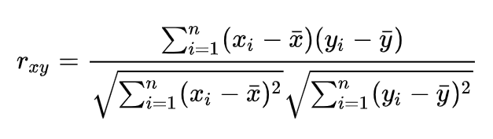
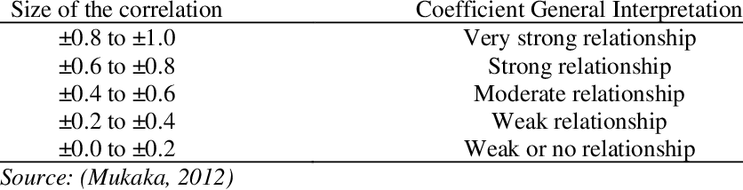

```{r setup, include=FALSE}
knitr::opts_chunk$set(echo = TRUE)

# Libraries
library(tidyverse)
library(here)
library(palmerpenguins)
library(corrplot)
library(lmtest)
```

## Quantifying relationships
So far, we have learned how to use descriptive statistics to describe the central tendency and spread of numeric data and used hypothesis testing to determine if mean values are significantly different from each other. But what if we want to quantify the relationship between variables? To do this, we can use correlation coefficients and linear regression. 

For this lesson, we will use a dataset called `palmerpenguins`, which is real data from Adélie, Chinstrap, and Gentoo penguins collected around the Palmer Archipelago in 2007-2009. The data have been put into an R package called `palmerpenguins`; please click over to your console and install the package using `install.packages('palmerpenguins')` now, if you do not already have it installed.

We will focus on Adélie penguins and discard the data from the other two species for now. Let's load and view a brief summary of our data to make sure there are no immediate issues to deal with.

```{r datasummary}
penguins <- as.data.frame(palmerpenguins::penguins)

penguins <- subset(penguins, species=='Adelie')

str(penguins)
summary(penguins)
```

There are missing values in these observations. We cannot work with missing values when calculating correlations or doing linear regressions, so we have to remove observations with any missing data.

```{r remove-missing}
# Remove missing values
penguins <- penguins %>% 
  drop_na()

# Check results
summary(penguins)
```

### Correlation
Correlation quantifies the strength of a linear relationship between a pair of continuous numeric variables. Correlation coefficients will fall between -1 and 1. There are a few methods for calculating the correlation coefficient, each of which have slightly different assumptions. For this example, we'll be calculating Pearson's correlation coefficient.

The mechanism of calculating correlation is all about the residuals, or the difference between each observation and the mean value of all observations. Let's say we are testing the correlation between variables x and y. In words, the formula would be:

The sum of the product of the residuals of variable x and the residuals of variable y for all samples

divided by

The square root of the sum of the product of the residuals of variable x squared for all samples and the sum of the product of residuals of variable y squared for all samples.

The mathematical formula representation is: 

```{r echo=FALSE, fig.align = "center", out.width="20%"}

```

In practice, we will not be calculating this by hand. We'll let R do the work for us. However, it's good to understand what is going on.

We would expect some variables to have a strong positive relationship-- for example, the number of apples grown on a farm should have a strong positive association with the number of trees on that farm. Increasing the number of trees should increase the number of apples. Strong positive relationships will have a correlation coefficient close to 1.

Other variables will have a strong negative relationship-- the number of rainy days in the summer will have a strong negative relationship with how tan you get. Increasing the number of rainy days should decrease your tan. Strong negative relationships will have a correlation coefficient close to -1.

Other variables may have no relationship at all. The number of apples grown on a farm will have no affect on your summer tan. So, the correlation coefficient here will be close to 0.

There are some "rules of thumb" for assessing the strength of association when it's not obviously strong or non-existent. The table below illustrates how we would normally think of relationships between variables given their correlation coefficients

```{r echo=FALSE, fig.align = "center", out.width="20%"}

```

Here we should pause to remind ourselves that CORRELATION DOES NOT EQUAL CAUSATION. What if we did find a strong positive relationship between number of apples grown on your local farm and your summer tan? The apples did not cause your tan. This could either be a pure coincidence OR an illustration of some common cause-- maybe here, warmer summers lead to both more apples and a better tan. Please make sure that you fully understand the difference between correlation and causation before continuing.

#### Assumptions
Statistics and mathematics, as a rule, do not allow for inferences without setting up some "background rules," called assumptions. We have to assess our dataset prior to beginning statistical analysis and make sure it does not violate the assumptions of whatever test we are running. For Pearson's correlation coefficient, the assumptions are:  

* Continuous numeric data
* Normal distribution
* No significant outliers
* Linear relationship between variables

Let's say we want to test the correlation between body mass, bill length, bill depth, and flipper length. We know that these three variables are continuous numeric-- if we had the technology, we could get infinitely more precise in the measurements for mass and length. We can check the rest of the assumptions in a few plots.

```{r corr-assumptions}
# Remove data that are not continuous numeric
penguins.numeric <- penguins %>% 
  select(body_mass_g, bill_length_mm, flipper_length_mm, bill_depth_mm)

# Check for normal distributions
hist(penguins.numeric$body_mass_g, main='Body mass')
hist(penguins.numeric$bill_length_mm, main='Bill length')
hist(penguins.numeric$bill_depth_mm, main='Bill depth')
hist(penguins.numeric$flipper_length_mm, main='Flipper length')

# Check for normal distributions and outliers
boxplot(penguins.numeric$body_mass_g, main='Body mass')
boxplot(penguins.numeric$bill_length_mm, main='Bill length')
boxplot(penguins.numeric$bill_depth_mm, main='Bill depth')
boxplot(penguins.numeric$flipper_length_mm, main='Flipper length')

# Check for linear relationships
plot(penguins.numeric)
```

In the histograms and boxplots, we can see that the distribution of all four variables is generally normal -- this looks like what is commonly called a "bell curve," where the mean value is at the center of the range of data and 95% of all observations are within about 2 standard deviations from the mean. The flipper length boxplot indicates two outliers-- one below and one above the mean. The bill depth boxplot indicates one outlier below the mean. Because these are not very far from the ends of the whiskers (which show 1.5 interquartile ranges from the mean), we'll keep the outliers.

In the scatterplot matrix, we can see that there are linear relationships between the variable pairs. Though some pairs will not likely have a strong association, the shape of the scatterplots do not appear to be curved in any way. Now that we've done this basic assessment of assumptions, we can continue to calculating the correlation.

#### Calcuating correlation
We have confirmed that we meet the assumptions necessary to calculate Pearson's correlation coefficient. We'll now generate the correlation coefficients for all possible comparisons of body mass, flipper length, and bill length.

```{r correlation}
# View correlations between numeric variables
penguins.numeric %>% 
  cor(method = "pearson")
```

This table shows us that there is are moderately strong positive relationships between body mass and bill length (0.54), body mass and bill depth (0.58), and body mass and flipper length (0.46). There are weak positive relationships between bill depth and bill length (0.39), flipper length and bill length (0.33), and flipper length and bill depth (0.31). Variables paired to themselves have a correlation coefficient of 1, of course.

We can visualize these variable pairings and the strength of their correlations using `corrplot`. You will need to install the `corrplot` package in the console if you do not have it. 

```{r correlationvis}
corrplot::corrplot(cor(penguins.numeric), # Create correlation matrix
                   diag=F,                # Don't check self-correlation
                   type='upper')          # Only visualize each pair once.
```

In this plot, we visualize the correlation coefficients of the six pairings we can make out of our four numeric variables. The color scale shows strong positive correlations (close to 1) as a navy color and strong negative correlations (close to -1) as a deep red. The size of the circles also indicates strength of correlations, with bigger circles indicating a stronger relationship. All of our correlations are positive and fall between "weak" and "moderate" strength.

### Linear regression
Linear regression is one of the most commonly-used approaches to modeling. You can model to _predict_ an outcome based on the information in a set of predictor variables, or you can model to _explain_ the relationship between an outcome and a set of explanatory variables. We'll continue working with our penguins dataset, and will use linear regression to explain the relationship between body mass (the response variable) and a set of explanatory variables.

In linear regression, the response variable needs to be a continuous numeric variable. We've already discussed that with improved technology, we could be increasingly precise with our penguin measurements, indicating body mass is a continuous numeric variable. The explanatory variables can be numerical or categorical. In a simple linear regression, there is only one explanatory variable. In multiple linear regression, there are many explanatory variables. We can use any combination of numeric and categorical variables in multiple linear regression, and we can also use interaction terms. For this example, we'll use bill length, bill depth, and sex as explanatory variables.

#### Assumptions
Like correlation, linear regressions rely on a number of assumptions. These are:  

* Independence of the observations in the data, and thus errors.
* Linearity between the response and explanatory variables.
* Normal or nearly normally distributed error terms.
* Constant variance of the error.

We will assume that these are independent observations, with an entirely different set of penguins being sampled each year. Repeated measurements would be a problem because the value of a penguin's body mass, or bill depth, or whatever at time x is likely related to its body measurements at time x-1 and x+1. This makes it harder to determine the effects of the explanatory variables. 


We have already explored normality, outliers, and linear relationships of the variables in our section on correlation, and have found no major issues. However, we should confirm that we still meet all these assumptions in the residuals of whatever model we eventually select. So, we'll come back to assessing our assumptions once we have fit a suitable model.

#### Numeric explanatory variable models
Let's fit some models with linear regression. We'll start by only using numeric variables as our explanatory variables. In this first case, Body mass is our response variable and bill length and bill depth will be our explanatory variables. 

We run a regression using the lm() function (stands for linear model). We first indicate the response variable (i.e., Mass) and then explanatory variables (Bill Length + Bill depth), followed by the name of the data. To obtain a summary of the results, you can use summary(). 

```{r model1}
Mass_model <- lm(body_mass_g ~ bill_depth_mm + bill_length_mm,
                 data=penguins)
summary(Mass_model)

```

So, how do we interpret these three values presented in the regression output?

Call: This is the formula for our model and the dataset we pull out information from.

Residuals: This is a basic summary of all residuals. Residuals are the difference between the actual value and the value predicted by the model for any given point. The range of the residuals looks really large, but we can't interpret what these results mean unless we pair them with the model predictions. We'll do that later.

Coefficient estimates:
Intercept: -1812.67. It is the predicted value of the response variable when all explanatory variables take a value of zero. In our case, when bill length is zero and when bill depth is zero. The intercept's p-value indicates it is significantly different from 0, but we don't care much about this because it is ecologically irrelevant. The intercept is used to situate the regression plane in 3D space. Obviously a penguin needs to have a positive value for lenghth and mass measurements, or else it doesn't exist. 

Bill depth: 163.58. Now that we have multiple variables to consider, we have to add an important statement to our interpretation: all other things being equal, for every unit increase in bill depth (which is measured in mm), there is an associated increase of, on average, 163.58 g in body mass.

Note that we are not making any causal statements here, only statements relating to the association between bill depth and body mass The all other things being equal statement addresses all other explanatory variables, in this case only one: bill length. This is equivalent to saying “holding bill length constant, we observed an associated increase of 163.58 g in body mass for every 1 mm increase in bill depth”

Bill length: 64.85. Similarly, all other things being equal, when a penguin's bill length increases by 1 mm, there is an associated increase of on average 64.85 g in body mass.

Also note the p-values of bill length and bill depth here. Both variables have very low p-values. If we want a 95% confidence interval, our alpha value threshold to reject the null hypothesis of no effect of bill length or bill depth on body mass is 0.05. The p-values for both bill length and bill depth are much lower than 0.05, which indicates that they are significant predictors of body mass.

Our adjusted -squared value for this model is 0.4496, which means bill length and bill depth explain about 45% of the variance in body mass seen in our sample.

#### Numeric and categorical explanatory variable models
Now we'll move on to a multiple linear regression using both numeric and categorical variables. Once again, body mass will be our response variable. We'll re-use bill length and bill depth as numeric explanatory variables, and also add sex as a categorical explanatory variable.

```{r model2}
Mass_model2 <- lm(body_mass_g ~ bill_depth_mm + bill_length_mm + sex,
                  data=penguins)
summary(Mass_model2)

```

In this model, females are treated as the baseline for comparison. The estimated difference in body mass for males is 476 g greater than it is for females. As you see from very low p-value, this coefficient is significant - i.e., sex has a strong effect on body mass.

Accordingly, the intercepts are (although there is no practical interpretation of the intercept here, as discussed in Scenario 1):

For females= 984.42 g
For males= 984.42 + 476.60 = 1461.02 g

The intercept no longer has a value significantly different from 0 (p-value is greater than 0.05). This is OK, because it has no ecological interpretation of the intercept in this model.

Both males and females have the same slope for bill length and bill depth. In other words, in this model the associated effects of bill length and bill depth on body mass are assumed to be the same for males and females.

All other output regarding bill length and bill depth is the same as our previous model. Note that our R-squared value has greatly increased-- adding sex as an explanatory variable has improved the performance of our body mass model!

#### Interaction term models
We say a model has an interaction effect if the associated effect of one variable depends on the value of another variable. Let's suppose that we expect male and female penguins to have different relationships between body mass and bill depth and body mass and bill length. We can fit a model where body mass is predicted by the interaction of sex and bill depth and the interaction of sex and bill length.

```{r model3}
Mass_model3 <- lm(body_mass_g ~  
                    bill_depth_mm:sex +
                    bill_length_mm:sex,
                  data=penguins)
summary(Mass_model3)
```

Our output got more complicated. The coefficients are separated by sex, indicating different rates of increase in body mass given 1 mm increases in bill depth and bill length for males and females. Let's focus for a minute on the results for females. The model indicates that every 1 mm increase in bill depth for females will result in a 99.9 g increase in body mass. For every 1 mm increase in bill length for females, body mass will increase 10.64 g. 

The male rates are very different-- a 1 mm increase in bill depth for males results in a 66.7 g increase in body mass, and a 1mm increase in bill length for males results in a 38.6 g increase in body mass.

The model's r-squared value increased only very slightly. We also now have one term, sexfemale:bill_length_mm, that is not statistically significant. Most likely, the predictive contribution of bill length to body mass between males and females is not significantly different.

### Model comparison
We've now run three different models attempting to predict Adélie penguin body mass given bill length, bill depth, and sex. It looks like our second and third models have been the most successful, as they have very similar R-squared values. Another important consideration is the "law of parsimony": models that are less complicated are typically better. 

There's another, more quantitative way to compare models. Aikake Information Criterion (AIC) is a unitless estimator of model prediction error. Models with less prediction error will have lower AIC values, and should be selected over models with more prediction error. We can pull and compare the AIC values of our three models.

```{r AIC}
# Mass ~ bill length + bill depth
AIC(Mass_model)
# Mass ~ bill length + bill depth + sex
AIC(Mass_model2)
# Mass ~ bill length:sex + bill depth:sex
AIC(Mass_model3)
```

Model selection via AIC confirms what we suspected: our second and third model performed the best. Note that usually, models with AIC values less than 2 units apart are considered functionally equal in predictive error. It is here that the law of parsimony has the most weight in model selection-- you should pick the less complicated model between two models with very similar AIC. In this case, that is model 2!

### Checking assumptions
Now we know how to perform a linear regression. However, the key question still remains: are these data suitable for linear regression? Do we comply with the assumptions? Again, these are the assumptions of linear regression:

* Independence of the observations in the data, and thus errors.
* Linearity between the numeric dependent and numeric explanatory variables.
* Normal or nearly normally distributed error terms
* Constant variance of the error

We will check these assumptions for our selected model prior to certifying the results as realistic.

#### Independent residuals 
As discussed, we will make the assumption that the researchers selected entirely different penguins each year, rather than the same penguins each year for the duration of the study.

#### Linearity
We will generate the residuals plot to test linearity. In multiple regression, the residual plot accommodates for other variables in the model to see the trend in the relationship between the response and explanatory variables. In a simple linear regression where we have only one explanatory variable, a scatter plot would have been sufficient to test the linearity of the relationship.

```{r linearity}
# Rerun model
Mass_model2 <- lm(body_mass_g ~ bill_depth_mm + bill_length_mm + sex,
                  data=penguins)

# Residual plots
plot(Mass_model2$residuals ~ penguins$flipper_length_mm)
abline(h=0, col='red')
plot(Mass_model2$residuals ~ penguins$bill_length_mm)
abline(h=0, col='red')
```

What we are looking for is a random scatter around zero. It seems like we are more or less meeting this condition for both variables.

#### Normal residuals
We can investigate the normality of the residuals via a normal probability plot (QQ-plot). We're looking for adherence of our residuals to a proposed line of normality (`qqline`). We can also quantitatively test for normality using a Shapiro-Wilk test. The null hypothesis of this test is that the inputs come from a normal distribution; if the p-value is less than 0.05, then we reject the null hypothesis and may assume a non-normal distribution.

If the residuals are not normal and our sample size is small, we may be concerned that our data are not acceptable for a linear regression. Solutions would include transforming the data (usually by taking the natural log) so that it more closely resembles a normal distribution.

```{r normality}
# Histogram of residuals
hist(Mass_model2$residuals)

# QQ plot of residuals
qqnorm(Mass_model2$residuals)
qqline(Mass_model2$residuals)

shapiro.test(Mass_model2$residuals)
```

The plots and Shapiro-Wilk test indicate that our model residuals are normally distributed, so we have no reason to transform our data or seek out alternative modeling methods.

#### Constant variability of residuals
We basically want our residuals to have same variability for lower and higher values of the predicted outcome variable. So, we need to check the plot of residuals versus the predicted body mass. Note that this is not the plot of residuals versus x, but takes into account all explanatory variables in the model at once by finding the predicted body mass. What we expect from this plot is randomly scattered residuals around zero without any obvious pattern. Obvious patterns, like a fan shape, would indicate a problem. We can also quantitatiely assess variance using a Breusch-Pagan test. The null hypothesis of this test is equal variance acros the range of explanatory variables. If the p-value of the test is less than 0.05, we can reject the null hypothesis and accept the alternative hypothesis of unequal variance.

```{r variance}
plot(Mass_model2$residuals ~ Mass_model2$fitted)
abline(h=0, col='red')

lmtest::bptest(Mass_model2)
```

We have residuals on y-axis and fitted-values on the x-axis. The residuals seem to be equally distributed above and below y=0; the two clear groups across the x-axis are indications of sex-based differences in model fit, but don't indicate we should reject the null hypothesis. The Breusch-Pagan test also indicates there is not enough evidence to reject the null hypothesis of equal variance. We have now confirmed that our data meet the assumptions of a linear regression model.

### Interpretation
That's the hard part of linear regression! You made a cool model that explained variance in penguin body mass given a set of other body-measurement variables. In the model, we found:

* Sex is a strong predictor of body mass
* Bill depth is a predictor of body mass
* Bill length is a predictor of body mass
* Models testing the interaction of bill depth and sex / bill length and sex are not significant improvements on a simpler additive model.

## Wrapup
In this lesson, we learned about quantifying relationships between response and explanatory variables using correlation and linear regression. Please take these concepts to your own data. Before you do anything else, you should always explore your data and visualize it to see if there are any obvious problems or patterns to address.